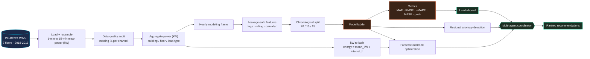
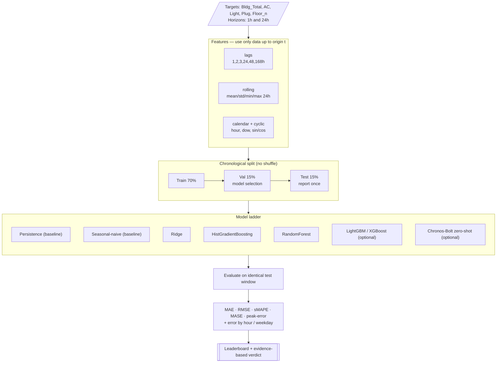
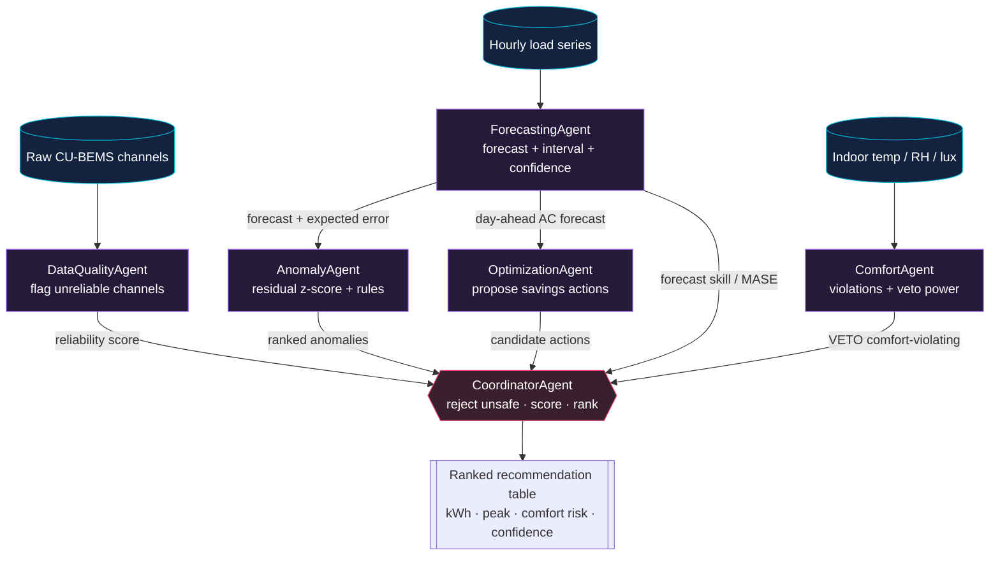
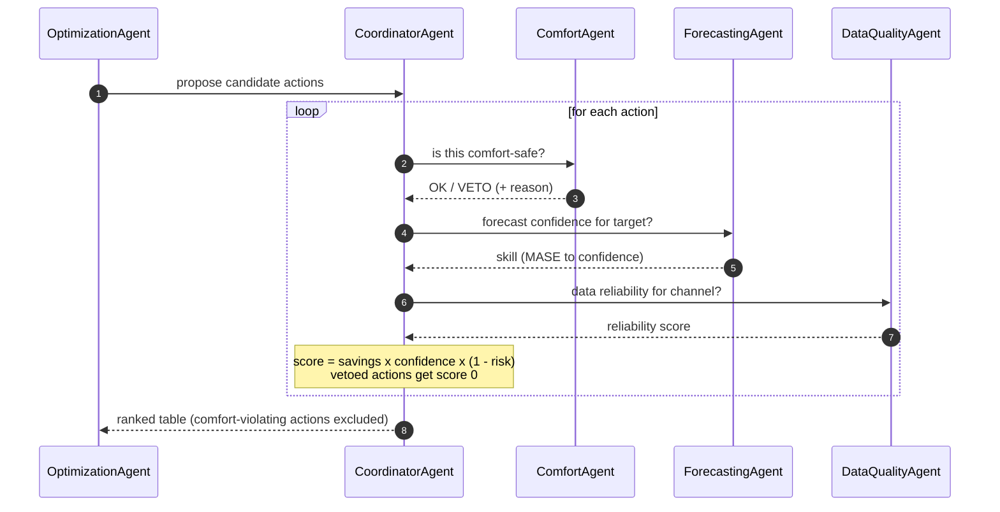
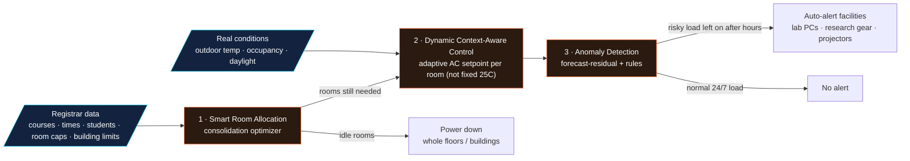

# Chulalongkorn Smart Campus Energy Intelligence — Pipeline & Architecture

Diagrams below are written in **Mermaid**. Any of these turn them into a picture:
- **GitHub** — renders ```mermaid blocks automatically in a README/`.md`.
- **mermaid.live** — paste a block → *Actions → PNG/SVG*.
- **VS Code** — “Markdown Preview Mermaid Support” extension.
- **CLI** — `mmdc -i ARCHITECTURE.md -o diagram.png` (`@mermaid-js/mermaid-cli`).

---

## 1 · System overview (guaranteed offline pipeline)



---

## 2 · Forecasting pipeline (leakage-safe detail)



---

## 3 · Multi-agent architecture



---

## 4 · Coordinator decision flow (how conflicts are resolved)



---

## 5 · Smart-campus product flow (the interactive demo)



---

## 6 · Rendering to an image — quick reference

| Tool | Command / action | Output |
|---|---|---|
| GitHub | commit this `.md` | inline render |
| mermaid.live | paste a block → **Actions** | PNG / SVG |
| Mermaid CLI | `npm i -g @mermaid-js/mermaid-cli` then `mmdc -i ARCHITECTURE.md -o arch.png -t dark -b transparent` | PNG/SVG per diagram |
| VS Code | *Markdown Preview Mermaid Support* extension → preview → screenshot | PNG |

> Tip: for slides, render each block individually on **mermaid.live** with theme **dark** and a transparent background, then export SVG (scales cleanly).
