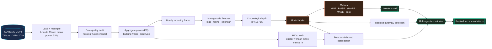
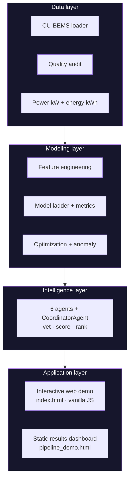
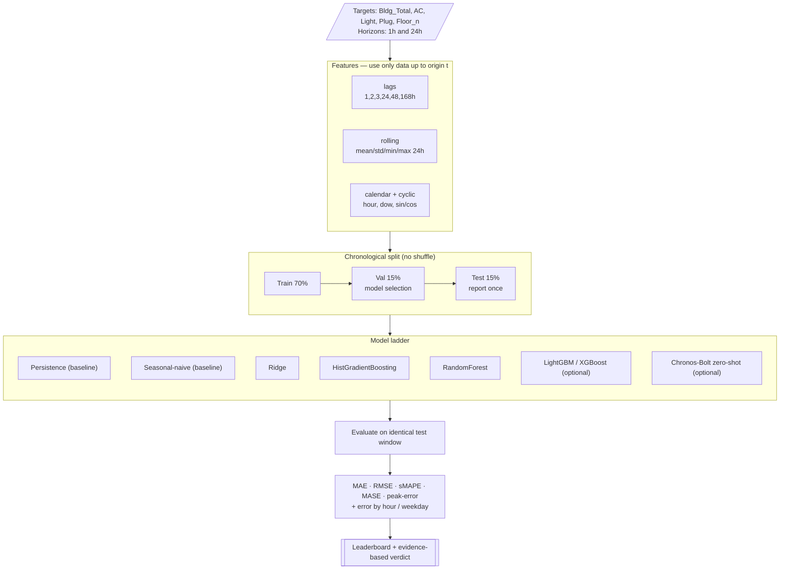
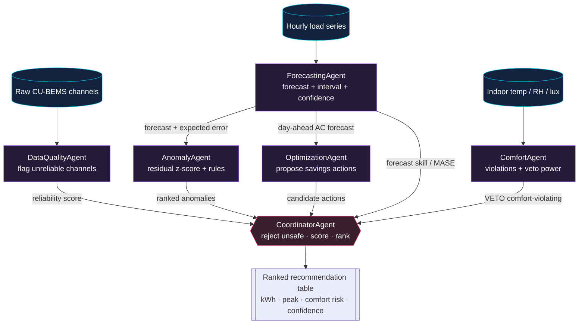
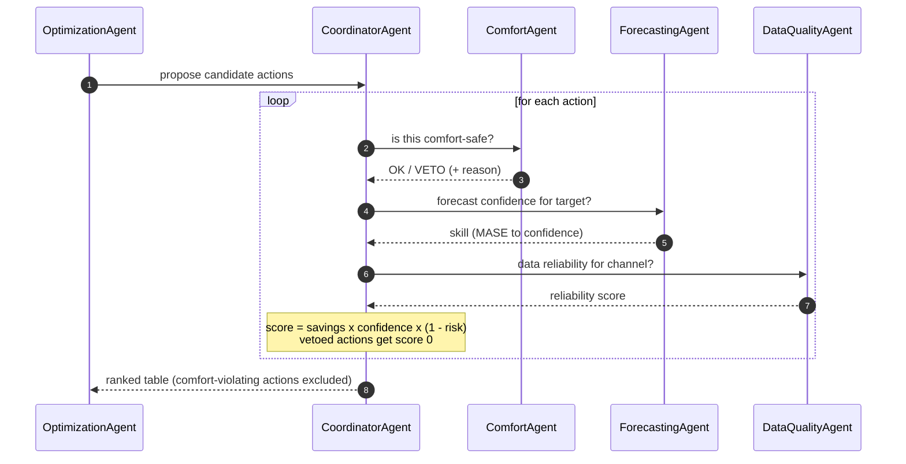
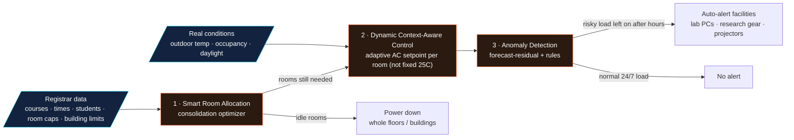
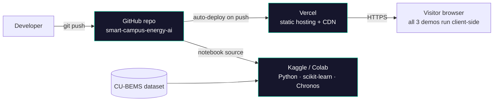

# Architecture — Chulalongkorn Smart Campus Energy Intelligence

This document describes how the system is put together: its layers, components,
data flow, the multi-agent decision core, and how it is deployed. Diagrams are
written in **Mermaid** (GitHub renders them inline; or paste a block into
[mermaid.live](https://mermaid.live) to export PNG/SVG).

**Contents**
1. [System overview](#1--system-overview)
2. [Layered architecture](#2--layered-architecture)
3. [Data layer](#3--data-layer)
4. [Modeling layer (forecasting)](#4--modeling-layer-forecasting)
5. [Intelligence layer (multi-agent)](#5--intelligence-layer-multi-agent)
6. [Coordinator decision flow](#6--coordinator-decision-flow)
7. [Application layer (the interactive demo)](#7--application-layer-the-interactive-demo)
8. [Deployment & runtime](#8--deployment--runtime)
9. [Key design decisions](#9--key-design-decisions)
10. [Tech stack](#10--tech-stack)

---

## 1 · System overview

The system turns raw sub-metered building data into **forecasts**, **anomaly
flags**, and **comfort-aware energy-saving recommendations**, then exposes a
public, interactive demonstration of the campus-level product. Everything runs
**offline-first**: the notebook needs only the CU-BEMS dataset, and the web demo
is a static page with no backend.

---

## 2 · Layered architecture

The codebase is organized into four layers. Each layer only depends on the one
below it, which keeps the forecasting core independent of how results are shown.

| Layer | Responsibility | Lives in |
|---|---|---|
| **Data** | load, clean, resample, audit, aggregate (power **kW** vs energy **kWh**) | notebook §1–4 |
| **Modeling** | leakage-safe features, chronological split, model ladder, metrics, anomaly, optimization | notebook §6–10 |
| **Intelligence** | six agents with explicit responsibilities + a coordinator | notebook §11 |
| **Application** | interactive demo (`index.html`) + static dashboard (`pipeline_demo.html`) | repo root |

---

## 3 · Data layer

**Inputs.** 14 CSVs (`2018Floor1.csv` … `2019Floor7.csv`), 1-minute resolution,
columns like `z2_AC1(kW)`, `z1_Light(kW)`, `z1_S1(degC)`.

**Responsibilities.**
- **Robust loading** — auto-detects the dataset folder under `/kaggle/input`,
  coerces timestamps, drops unparseable rows, removes duplicate timestamps.
- **Resampling** — 1-min → 15-min **mean power (kW)** to cut memory ~10×.
- **Quality audit** — missing % and zero % per channel (energy meters are
  reliable; environmental sensors carry the most missing data).
- **Aggregation** — floor/building **power** series with an explicit `_kW`
  suffix, plus environment averages (°C / %RH / lux).

**The unit rule (applied once, everywhere):**
> `energy_kWh = mean_power_kW × interval_hours` (0.25 h for 15-min bins, 1.0 h for hourly).
> Power values are never summed and called kWh.

---

## 4 · Modeling layer (forecasting)

Forecasts building and per-load-type demand at **1 h** and **24 h** horizons
under a strict, leakage-safe protocol.

**Why a ladder?** A model is only allowed to "win" if it beats the **baselines**
on the **same** held-out window. **MASE < 1** means "better than seasonal-naïve".
The **foundation model (Amazon Chronos-Bolt)** is optional and zero-shot — it is
evaluated on the *identical* test origins so the comparison is fair, and it skips
cleanly if internet/packages are unavailable.

---

## 5 · Intelligence layer (multi-agent)

Each agent is a real class with one responsibility. They operate on the objects
the modeling layer produces and hand structured outputs to the coordinator.

| Agent | Responsibility | Consumes | Produces |
|---|---|---|---|
| `DataQualityAgent` | flag unreliable channels | quality report | reliability score |
| `ForecastingAgent` | forecasts + prediction interval + confidence | models, leaderboard | forecast, expected error, MASE-confidence |
| `ComfortAgent` | comfort violations; **veto** unsafe actions | env sensors, comfort bands | OK / VETO + reason |
| `AnomalyAgent` | surface & explain abnormal hours | forecast residuals + rules | ranked anomalies |
| `OptimizationAgent` | propose savings actions | day-ahead forecast | candidate actions (kWh, peak) |
| `CoordinatorAgent` | vet, score, rank | all of the above | final ranked table |

---

## 6 · Coordinator decision flow

The coordinator is where **conflicts are resolved**. It asks the ComfortAgent to
**veto** any action that would push an already-hot zone past the comfort band,
attaches a confidence from forecast skill and data quality, and ranks survivors
by `savings × confidence × (1 − risk)`.

---

## 7 · Application layer (the interactive demo)

The campus-facing product is demonstrated by `index.html` — a static, zero-dependency
page where the three features run **entirely in the browser**.

- **Smart Room Allocation** — a greedy **consolidation optimizer** packs classes
  into the fewest buildings/floors so the rest power down.
- **Dynamic Context-Aware Control** — ASHRAE-55 adaptive-comfort setpoints per
  room, driven by real occupancy/daylight/weather instead of a uniform 25 °C.
- **Anomaly Detection** — forecast-residual + rules flag risky loads left on
  after hours, while ignoring legitimately 24/7 loads.

---

## 8 · Deployment & runtime

There is **no server**. The notebook runs in a data-science runtime; the web
demo is static and runs client-side, hosted on Vercel with auto-deploy on push.

| Component | Runtime | Notes |
|---|---|---|
| Forecasting + agents | Kaggle / Colab (Python) | offline-safe; foundation model optional |
| Interactive demo | Vercel (static) → visitor browser | no backend, no build step |
| Source of truth | GitHub | push triggers a Vercel redeploy |

---

## 9 · Key design decisions

- **Leakage safety first.** Features use only data up to the forecast origin;
  the test window is the final calendar slice and is identical for every model.
- **Baselines are first-class.** Persistence and seasonal-naïve are always
  reported; advanced models must beat them on the same window (verdict is data-driven).
- **Foundation model is optional and guarded.** Auto-installs / downloads when
  enabled and online; skips cleanly otherwise. The pipeline never depends on it.
- **Units are explicit.** One helper converts power → energy; all cost/CO₂
  figures flow through it and are flagged as **illustrative assumptions**.
- **Agents over narrative.** "Multi-agent" is implemented as classes with
  explicit responsibilities and real coordination (veto + ranking), not prose.
- **Offline-first, no backend.** Notebook needs only the dataset; the web demo is
  static and dependency-free — trivial to host and to audit.

---

## 10 · Tech stack

`Python` · `pandas` · `NumPy` · `scikit-learn` (Ridge, HistGradientBoosting,
RandomForest, Isolation Forest) · `LightGBM`/`XGBoost` (optional) ·
**Amazon Chronos-Bolt foundation model** (`PyTorch`, optional) · `Matplotlib` ·
custom multi-agent architecture · **vanilla JS / inline SVG** web demo ·
**GitHub + Vercel** for source and hosting.

> CU-BEMS is one building (2018–2019); occupancy is a calendar proxy; energy/cost/CO₂
> numbers are illustrative, not validated bills. See the notebook for full limitations.
