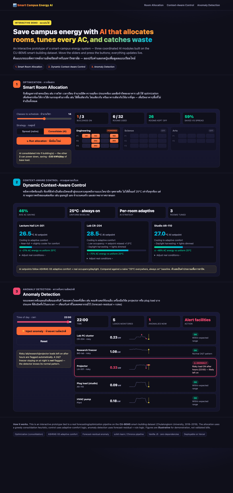
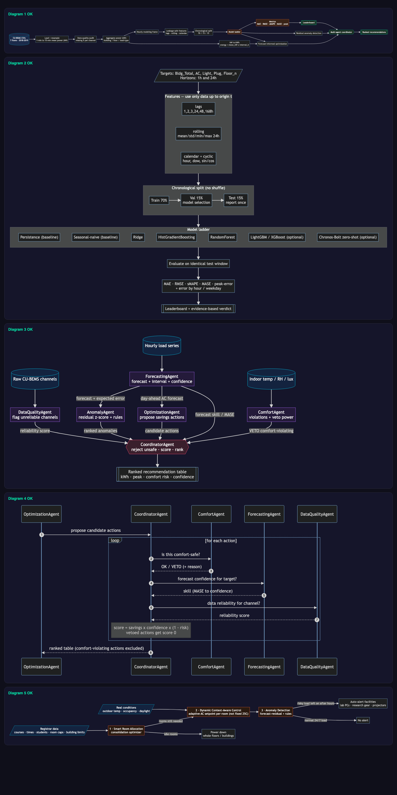

# 🏙️ Chulalongkorn Smart Campus Energy Intelligence

**Foundation-model-based energy forecasting + a multi-agent optimizer for smart-building energy management**, built on the **CU-BEMS** smart-building dataset (Chulalongkorn University, Bangkok · 7 floors · 2018–2019).

> **Live interactive demo:** deploy the site in ~30s with the button above (or import this repo at [vercel.com/new](https://vercel.com/new)). The demo is the `index.html` at the repo root — static, zero-dependency, no build step.

---

## ✨ What's inside

| Part | File | What it is |
|---|---|---|
| **Interactive web demo** | [`index.html`](index.html) | 3 features you can try live (below) |
| **Forecasting + agents notebook** | [`multi-agent-ai-for-smart-building-optimisation.ipynb`](multi-agent-ai-for-smart-building-optimisation.ipynb) | the full Kaggle/Colab pipeline |
| **Architecture diagrams** | [`ARCHITECTURE.md`](ARCHITECTURE.md) | Mermaid pipeline + agent diagrams |
| **Results dashboard** | [`pipeline_demo.html`](pipeline_demo.html) | static slide-ready charts |

---

## 🌐 Interactive demo — three coordinated AI modules

1. **Smart Room Allocation** — a consolidation **optimizer**: takes registrar data (courses, times, students, room capacity/type, building limits) and packs classes into the fewest buildings/floors so the rest **power down**.
2. **Dynamic Context-Aware Control** — per-room AC setpoints from **ASHRAE-55 adaptive comfort** + real occupancy/daylight/outdoor weather — *not* a uniform 25 °C everywhere.
3. **Anomaly Detection** — flags **risky loads left on after hours** (lab PCs, research gear, projectors, plug loads) using forecast-residual + rule logic; a legitimate 24/7 freezer is **not** falsely flagged.

---

## 🔬 The forecasting + multi-agent pipeline (notebook)

A reproducible, **leakage-safe** electricity-forecasting pipeline with an evidence-based model leaderboard, plus a real multi-agent decision layer.

- **Targets:** building total + AC / lighting / plug + floor totals · **horizons:** 1 h and 24 h
- **Leakage-safe features:** lags (1,2,3,24,48,168 h), rolling stats, calendar/cyclic
- **Chronological split** (70/15/15) — same test window for every model
- **Model ladder:** Persistence · Seasonal-naïve · Ridge · HistGradientBoosting · RandomForest · *LightGBM/XGBoost (optional)* · **Amazon Chronos-Bolt zero-shot foundation model (optional)**
- **Metrics:** MAE · RMSE · sMAPE · **MASE** · daily-peak error
- **6 agents:** `DataQualityAgent`, `ForecastingAgent`, `ComfortAgent`, `AnomalyAgent`, `OptimizationAgent`, and a `CoordinatorAgent` that **vetoes** comfort-violating actions and ranks the rest.

See [`ARCHITECTURE.md`](ARCHITECTURE.md) for all diagrams (pipeline, agents, coordinator decision flow, product flow).

---

## 🧰 Tech stack

`Python` · `pandas` · `NumPy` · `scikit-learn` (Ridge, HistGradientBoosting, RandomForest, Isolation Forest) · `LightGBM`/`XGBoost` · **Amazon Chronos-Bolt (PyTorch)** · `Matplotlib` · custom multi-agent architecture · **vanilla JS** web demo · **Vercel** hosting.

---

## ▶️ Run it

**Notebook (Kaggle):** attach the *CU-BEMS Smart Building Energy and IAQ Data* dataset and run top-to-bottom. The foundation-model section is optional (needs Internet → On); everything else runs offline.

**Web demo (local):** open `index.html`, or `python3 -m http.server 8000`.

**Web demo (Vercel):** click the **Deploy with Vercel** button above, or push to GitHub and import at [vercel.com/new](https://vercel.com/new) (no config — static site).

---

## ⚠️ Notes & limitations

CU-BEMS is **one building**, 2018–2019; occupancy is a calendar proxy; energy/cost/CO₂ figures are **illustrative assumptions**, not validated bills; foundation models don't always beat tuned gradient-boosting. Full limitations are in the notebook.

---

*Dataset: [CU-BEMS](https://www.kaggle.com/datasets/claytonmiller/cubems-smart-building-energy-and-iaq-data) (Chulalongkorn University). Demo figures are illustrative.*
